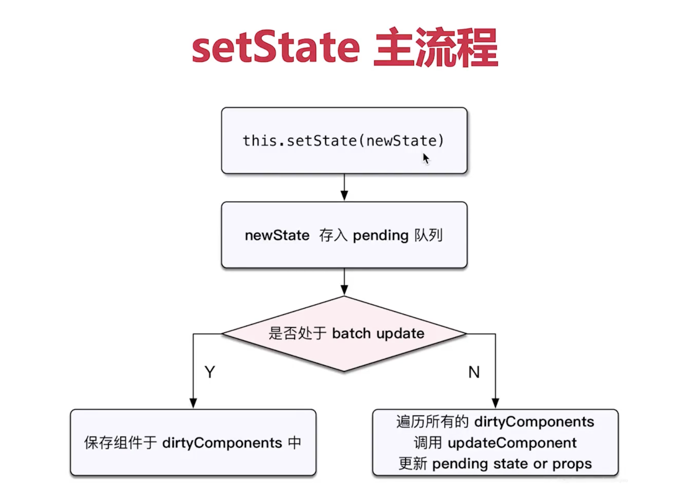

# 1. react 原理

## 1. 函数式编程

- 纯函数
- 不可变值

## 2. VDOM

- h 函数：用来创建虚拟 DOM 的函数，也叫 hyperscript 函数。该函数是 React.createElement()的缩写形式
  - 接收三个参数：标签名，属性对象，子元素
  - 返回一个描述虚拟 DOM 节点的 JS 对象，也就是 vnode
  - 代码
    ```js
    // jsx
    <div className='container'>
      <h1>Hello</h1>
    </div>;
    // h 函数
    h('div', { className: 'container' }, h('h1', null, 'Hello'));
    ```
- vnode 数据结构：表示虚拟 DOM 元素的 JS 对象，它包含重要信息：

  - 元素的类型
  - 属性
  - 子元素
  - 代码

    ```js
    // vnode 数据结构
    {
        type: string | function, // 元素类型，可以是html标签名或者组件函数
        key: string | number | null, // 标识元素的唯一健
        ref: function | null, // 该元素挂载后调用的回调函数
        props: { // 元素的属性
            [string]: any
        },
        children: Array<VNode | string> | VNode | string | null, // 子元素
        // ... 其他元数据
    }
    // vnode 实例
    {
        type: 'div',
        props: {
            className: 'container'
        },
        children: [
            {
                type: 'h1',
                children: 'Hello'
            }
        ]
    }

    ```

- patch 函数：VDOM 上的 diff 算法
  - 接受两个参数：旧的 VDOM 节点 和新的 VDOM 节点
  - 用于将新的 VDOM 节点和旧的 VDOM 节点进行比较，生成一个需要更新的操作列表
  - 根据列表实现将 VDOM 树 转化为真实 DOM 树的过程
  - 使用协调算法（Reconciliation）尽可能减少 DOM 的操作次数，从而提高渲染性能

## 3. DIFF 算法

- 同级比较：只会比较同级节点之间的差异，不会跨级比较
- 从根节点开始，先比较节点类型，再比较属性，然后递归比较子节点
  - 如果节点类型不同，删除该节点，创建新节点
  - 如果节点类型相同，比较节点的属性。节点属性不同，直接替换成新的属性
    - 递归比较子节点
      - 同一层级的一组子节点
        - 如果可以通过 key 区分，React 尽可能复用相同的 key 的元素，而不是销毁重建
        - 当遇到不同节点时，React 会根据新节点的位置，找到相对应的节点进行移动，而不是销毁重建
      - 如果新节点没有该子节点，直接移除该子节点
      - 如果旧节点没有该子节点，直接添加该子节点

## 4. JSX 的本质

- JS 的语法扩展，允许在 JS 中嵌入 HTML 标记语言
- 它通过 Babel 等工具转换成 React.createElement 函数调用，再返回一个描述组件的 JS 对象，也就是 VDOM。
- 语法糖，为了更方便高效地创建 React 组件
- 语法总结：
  - React.createElement 即 h 函数，返回 vnode
  - 第一个参数可以是 HTML 标签，也可以是组件（组件的话首字母大写）

```js
// JSX https://www.babeljs.cn/
const elem = (
  <Input
    className='my-class'
    style={{ color: 'red' }}
    onClick={this.onDivClick}
  >
    <p>test</p>
    <ul>
      {this.state.list.map((item) => {
        return <li key={item.id}>{item.title}</li>;
      })}
    </ul>
  </Input>
);
// JS
const elem = React.createElement(
  Input,
  {
    className: 'my-class',
    style: {
      color: 'red',
    },
    onClick: this.onDivClick,
  },
  React.createElement('p', null, 'test'),
  React.createElement(
    'ul',
    null,
    this.state.list.map((item) => {
      return React.createElement(
        'li',
        {
          key: item.id,
        },
        item.title
      );
    })
  )
);
```

## 5. 合成事件

- 事件挂载
  - React 17 以前：所有事件挂载到 document 上
  - React 17 开始：所有事件挂载到 root 上，有利于多个 React 版本并存
- Event 非原生的，是 Synthetic Event，即合成事件对象
- 为什么要合成事件？
  - 更好的兼容性和跨平台，不需要考虑不同底层浏览器的差异性
  - 性能优化：加载到 document，实现事件的批量处理，提高性能
  - 方便统一管理，例如对某些事件进行防抖或者节流等优化处理
  - 有更好的扩展性：提供更丰富的事件处理能力


## 6. setState 和 batchUpdate

1. 同步还是异步

   - 同步：命中 batchingUpdate
     - 使用场景：普通使用
     - 哪些能命中 batchingUpdate？React 可以管理的入口
       - React 生命周期，和调用它的函数：`componentDidMount`
       - React 中注册的事件，和调用它的函数：`onClick`
   - 异步：没有命中 batchingUpdate
     - 使用场景：setTimeout，自定义 DOM 事件 - `addEventListener`

   ```js
   // 普通使用 - 异步
   increase = () => {
     // 开始，处于batchUpdate
     // isBatchingUpdates = true
     this.setState({
       count: this.state.count + 1,
     });
     // 结束
     // isBatchingUpdates = false
   };

   // setTimeout - 同步
   increase = () => {
     // 开始，处于batchUpdate
     // isBatchingUpdates = true
     setTimeout(() => {
       // isBatchingUpdates = false
       this.setState({
         count: this.state.count + 1,
       });
     });
     // 结束
     // isBatchingUpdates = false
   };
   ```

2. 有时合并（对象形式），有时不合并（函数形式）
3. setState 主流程 

## 7. 组件渲染和更新过程

### 1. 组件渲染

1. React 根据 props 和 state 创建 VDOM：render() -> vnode
2. 根据 VDOM，生成渲染出实际的 DOM： render(elem, vnode)

### 2. 更新过程

1. 当组件的 state 或 props 发生变化时，React 会根据新的数据重新渲染组件：setState(newState) -> dirtyComponents
2. 重新渲染之前，React 会生成一个新的 VDOM：render() -> newVnode
3. diff 算法的执行：比较新旧 VDOM 的差异，计算出需要更新的部份：patch(vnode, newVnode)
4. 更新实际的 DOM：render(elem, vnode)

## 8. patch 函数

### 1. patch 更新的两个阶段

1. reconciliation 阶段：执行 diff 算法
2. commit 阶段：将 diff 结果渲染到 DOM

### 2. 性能问题

1. JS 是单线程的，且和 DOM 的渲染共用一个线程
2. 当组件非常复杂的时候，组件更新时的计算和渲染的压力大，一旦渲染开始，它就必须一直运行直到完成。
3. 如果同时再有动画等其他 JS 任务，用户界面就会有可能发生卡顿

### 3. 解决方案 fiber

1. 构建 Fiber 树：根据组件树生成 Fiber 节点树，每个 Fiber 节点包含了一些元信息，如优先级，过期时间等等
2. 确定任务优先级：将任务拆分成多个小的任务单元，并且按照优先级进行调度
3. 任务可中断性：可以在任何时候中断任务，并且保存当前任务的状态。等主线程空闲时再恢复和继续执行任务
4. 通过 `window.requestIdleCallback` 知道浏览器是否空闲

# 2. 面试

1. 组件之间如何通讯

- 父子组件通过 props
- Redux
- Context

  - 组件之间共享数据的方式，它可以将数据传送给组件树中任意一个组件，不必一级一级地通过 props 传递
  - 通常处理一些简单的公共信息：主题色和语言

    ```jsx
    // 创建一个 Context 对象
    const MyContext = React.createContext({ greed: 'default name' });

    // 生产者
    <MyContext.Provider value={{ greed: 'hello' }}>...</MyContext.Provider>;

    // 订阅者
    const ctx = React.useContext(MyContext);
    <div>{ctx.greed}</div>;
    ```

- 自定义事件，例如发布订阅机制

2. React 性能优化

   - 渲染列表时使用 key
   - 及时销毁自定义事件和 timer 等
   - 合理使用异步组件
   - 减少函数 bind this 的次数
   - 合理使用 SCU，pureComponent 和 memo（函数组件中的 PureComponent）
   - 合理使用 Immutable.js
   - webpack 层面的优化
   - 前端通用的新能优化，如图片懒加载
   - 使用 SSR

3. React 和 Vue
   - 相同点
     - 都支持组件化
     - 都是数据驱动视图
     - 都使用 VDOM 操作 DOM
   - 不同点
     - React 使用 JSX；Vue 使用模板语法
     - React 基于函数式编程思想，如纯函数和不可变性，但它不是纯粹的函数式编程；Vue 属于声明式编程，在模板语法中使用了声明式来描述 UI 界面，不需要直接操作 DOM
     - React 更多需要自力更生；Vue 有更多 built in 的功能使用
