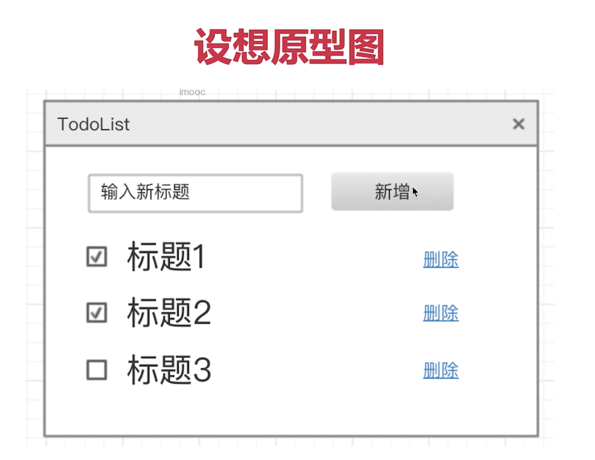

# 1. 项目设计

## 1. React 实现 Todo List



### 1. state 数据结构设计

- 数据表述内容
- 数据要结构化，易于操作
- 数据要可扩展，以便增加新功能

```js
this.state = {
  list: [
    {
      id: 1,
      title: 'abc',
      completed: false,
    },
  ],
};
```

### 2. 组件设计和通讯


- 从功能上拆分层次，父子分层
- 尽量让组件原子化
- 容器组件（只管理数据）和 UI 组件（只显示视图）

# 2. 项目流程

1. 项目角色
   - PM 产品经理
   - UX 视觉设计师
   - FE 前端开发
   - BE 后端/移动端开发
   - QA 测试人员
2. 项目阶段
   - 需求分析：各个角色
     - 了解背景：做什么
     - 质疑需求的合理性：为什么要做
     - 需求是否闭环：需求是否完整 - 收集，定义，规划，实现，监控，审核，改进
     - 开发难度如何
     - 是否需要其他（后端，设计师）支持
     - 不要急于给 timeline
   - 技术方案设计：前端和后端
     - 求简，不过度设计
     - 设计文档
     - 找出设计的重点 - 输入输出
     - 组内评审
     - 和项目其他角色沟通
     - 改进和总结最终方案并发给相关人员
   - 开发：前端
     - 制定 timeline
       - 留一个 buffer
       - 考虑并行工作，有没有其他项目
       - 考虑 dependency，例如设计师和后端
     - 代码符合开发规范
       - HTML：采用语义化标签，结构清晰
       - CSS：避免行内样式
       - JS：面向对象和函数式编程，避免全局变量
       - 变量和函数的命名和代码的兼容性
     - 写开发文档：公共的组件和 API
     - 写单元测试
     - Mock API，模拟数据
     - Code Review
   - 联调：前端，设计师和后端
     - 和后端技术联调
     - 让设计师确定视觉效果
     - 让 PM 确定产品功能
   - 测试：前端，后端和 QA
     - 提测发邮件，抄送项目组
     - 测试问题要详细记录
     - 有问题及时沟通，让 QA 帮忙复现
   - 上线：前端
     - 及时通知 QA 进行回归测试
     - 同步 PM 和项目组
     - 如有问题，及时回滚。先止损，再排查
3. 项目计划和执行

### 3. 面试题

1. PM 想在项目开发过程中增加需求，该怎么办
   - 不能拒绝，走需求更新流程
   - 如果公司有规定，按规定走
   - 否则，发起项目组和 leader 的重新评审，重新评估 timeline
2. 项目即将延期了，该怎么办
   - 分析原因
     - 资源缺乏
     - 需求改变
     - 进度估算不准确
   - 重新评估进度：识别和调整过于乐观的时间估算
   - 优化资源配置：如果由于资源缺乏，可以重新分配资源，增加人员和预算。如果没有办法优化资源，延长项目时间表
   - 与相关方沟通：即使沟通项目进度和延期风险，并且共同制定方案
3. 你将如何保证项目的质量
