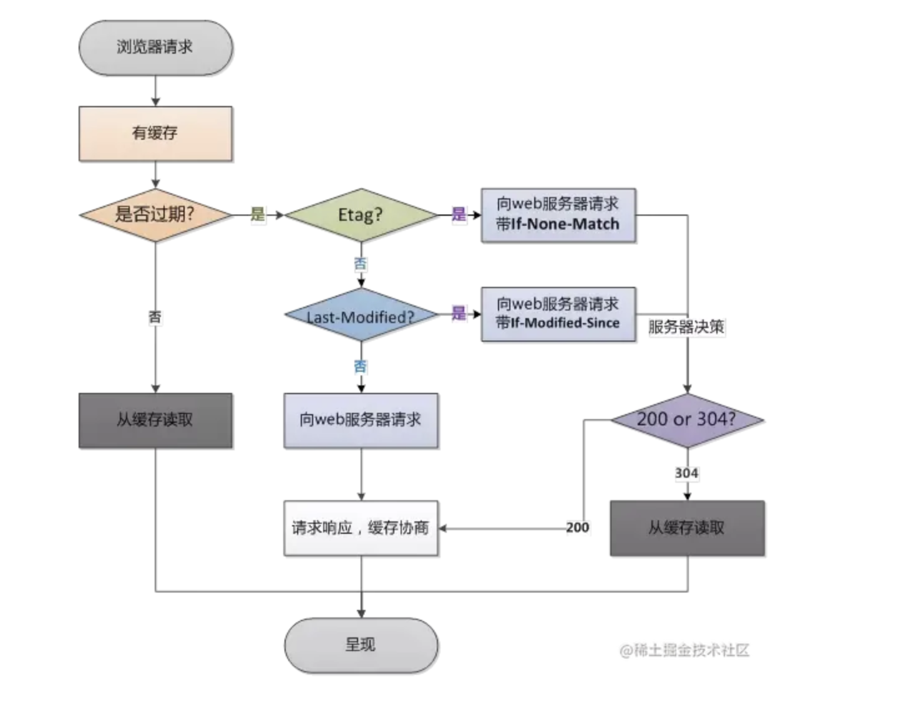
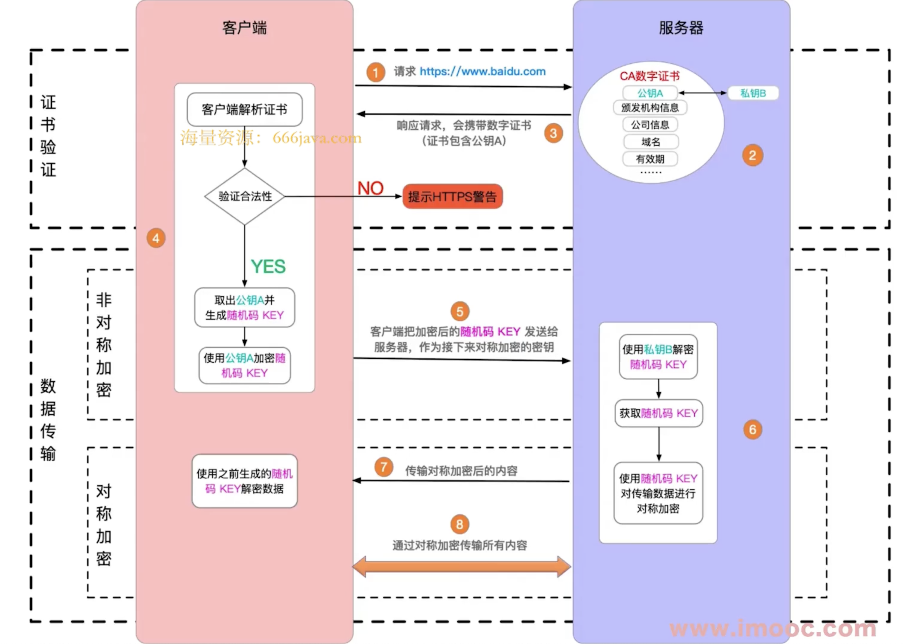

# 1. http 状态码

## 1. 状态码分类

1. 1xx 服务器收到请求
2. 2xx 请求成功
3. 3xx 重定向
4. 4xx 客户端错误
5. 5xx 服务端错误

## 2. 常见状态码

1. 200 成功
2. 301 永久重定向，浏览器下次直接访问新的地址
3. 302 临时重定向，浏览器下次继续访问旧的地址
4. 304 资源未被修改且未过期，服务端不返回数据，浏览器用上次缓存的数据
5. 404 资源未找到
6. 403 没有权限
7. 500 服务器错误
8. 504 网关超时

# 2. http 方法

## 1. 传统的 methods

1. **get** 获取服务器的数据
2. **post** 向服务器提交数据

## 2. 现在的 methods

1. **get** 获取数据
2. **post** 新建数据
3. **patch**/**put** 更新数据
   - patch 部份更新
   - put 完全更新，如果数据不存在则创建新的数据
4. **delete** 删除数据

## 3. Restful API

1. 传统 API 设计：把每个 url 当做一个功能
2. Restful API 设计：把每个 url 当做一个唯一的资源
   - 尽量不用 url 参数
     - 传统：`/api/list?pageIndex=2`
     - Restful：`/api/list/2`
   - 用 **method** 表示操作类型
     - 传统:
       - 创建：post `/api/create-blog`
       - 更新：post `/api/update-blog?id=100`
       - 获取：get `/api/get-blog?id=100`
     - Restful:
       - 创建：post `/api/blog`
       - 更新：patch/put `/api/blog/100`
       - 获取：get `/api/blog/100`

# 3. http 头

## 1. 常见的 Request Headers

1. **accept** 浏览器可接收的数据格式
2. **accept-encoding** 浏览器可接收的压缩算法，如 gzip
3. **accept-language** 浏览器可接收的语言，如 zh-CN
4. **connection: keep-alive** 一次 TCP 连接重复使用
5. **cookie** 浏览器的 cookie
6. **host** 请求的域名
7. **user-agent** 浏览器信息
8. **content-type** 发送数据的格式，如 application/json

## 2. 常见的 Response Headers

1. **content-type** 发送数据的格式，如 application/json
2. **content-length** 返回数据的大小，多少字节
3. **content-encoding** 返回数据的压缩算法，如 gzip
4. **set-cookie** 服务端设置的 cookie

## 3. 自定义 Header

`headers: { 'X-Requested-With': 'XMLHttpRequest' }`

## 4. 缓存相关的 headers

1. `cache-control` 和 `expires`
2. `last-modified` 和 `if-modified-since`
3. `etag` 和 `if-none-match`

# 4. http 缓存

## 1. 缓存的介绍

### 1. 什么是缓存

浏览器缓存(Brower Caching)是浏览器对之前请求过的文件进行缓存，以便下一次访问时重复使用，节省带宽，提高访问速度，降低服务器压力

### 2. 为什么需要缓存

1. 减少数据的传输
2. 加快数据访问速度和页面的响应时间
3. 节省网络宽带
4. 降低服务器负载

### 3. 哪些资源可以被缓存

静态资源 - js css img

## 2. 缓存策略

### 1. 强制缓存

1. 什么是强缓存？
   浏览器不会像服务器发送任何请求，直接从本地缓存中读取文件并返回 Status Code: 200 OK

   - `200 form memory cache`: 不访问服务器，一般已经加载过该资源且缓存在了内存当中，直接从内存中读取缓存。浏览器关闭后，数据将不存在（资源被释放掉了），再次打开相同的页面时，不会出现 from memory cache。
   - `200 from disk cache`: 不访问服务器，已经在之前的某个时间加载过该资源，直接从硬盘中读取缓存，关闭浏览器后，数据依然存在，此资源不会随着该页面的关闭而释放掉下次打开仍然会是 from disk cache。
   - 优先访问 memory cache,其次是 disk cache，最后是请求网络资源

2. cache-control

   - 存在 response headers 中
   - 控制强制缓存的逻辑
   - 例如 cache-control: max-age = 31536000 (单位是秒)
   - cache-control 的值
     - **max-age**：指定缓存的最大有效期，单位是秒
     - **no-cache**：强制客户端直接向服务器发送请求,也就是说每次请求都必须向服务器发送，服务器接收到请求，然后判断资源是否变更，是则返回新内容，否则返回 304，未变更
     - **no-store**：禁止使用任何缓存，每次都必须从服务器获取最新的数据
     - **private**：只能被单个用户缓存，不允许中间代理服务器进行缓存
     - **public**：可以被任何缓存器缓存，包括中间代理服务器和浏览器缓存

3. expires
   - 存在 response headers 中
   - 控制强制缓存的逻辑
   - 已被 cache-control 代替

### 2. 协商缓存（对比缓存）

1. 什么是协商缓存？
   向服务器发送请求，服务器会根据这个请求的 request header 的一些参数来判断是否使用协商缓存，如果确认使用，则返回 304 状态码并带上新的 response header 通知浏览器从缓存中读取资源
2. 属于服务端缓存策略
3. 服务端用**资源标识**来判断客户端请求的资源是否和服务端资源一样
4. 如果一致则返回 304 - Not Modified 响应，否则返回 200 和最新的资源
5. 资源标识
   - 存在 response headers 中，有两种
   - `last-modified`： 资源的最后修改时间，和 request headers 里的 `if-modified-since` 对比
   - `etag`： 资源的唯一标识符，和 request headers 里的 `if-none-match` 对比
   - 优先使用`etag`，
     - `last-modified`因为只能精确到秒级
     - 如果资源被重复生成而内容不变，`etag`更精准

## 3. 缓存综述

## 4. 刷新对缓存的影响

1. 正常操作 - 地址栏输入 url，浏览器前进后退：强制缓存有效，协商缓存有效
2. 手动刷新 - f5，点击刷新按钮，右击菜单刷新：强制缓存失效，协商缓存有效
3. 强制刷新 - ctrl + f5：强制缓存失效，协商缓存失效

# 5. https

## 1. http 和 https

1. http 是明文传输，敏感信息容易被中间劫持
2. https = http + 加密，劫持了也无法解密
3. 现代浏览器已开始强制 https 协议

## 2. https 加密方式

### 1. 加密种类

1. 对称加密：用同一个密钥来加密和解密
2. 非对称加密：公钥加密，私钥解密

### 2. https 加密方式

1. 发送方：
   - 用对称密钥来加密内容
   - 用接收方的公钥加密对称密钥
2. 接收方
   - 用自己的私钥解密对称密钥
   - 用对称密钥解密内容
3. 为什么这样加/解密？
   - 效率快
   - 成本低

### 3. https 证书

1. 中间人攻击：
   - 服务端发送的公钥到客户端的过程中有可能被第三方劫持，
   - 然后第三方将自己的公钥发送给客户端
   - 客户端用对称密钥加密数据，然后用第三方的公钥加密对称密钥，再发送给服务端
   - 第三方再次劫持，用自己的私钥解密对称密钥，再用对称密钥解密数据。
   - 第三方用之前劫持的公钥加密对称密钥，发送给服务端
2. 这就需要使用第三方数字证书：数字证书是由权威的机构给服务端进行颁发，CA 机构通过服务端提供的相关信息生成证书，证书内容包含了持有人的相关信息，服务器的公钥，签署者签名信息（数字签名）等，最重要的是公钥在数字证书中。
3. 浏览器负责验证证书

## 3. https 工作流程图

