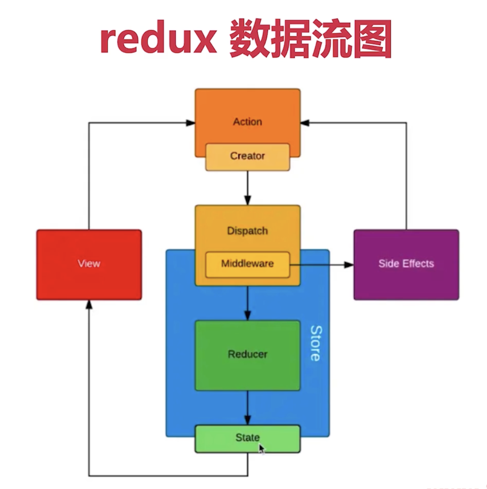

# 1. react 事件

1. react 里的 event 是 SyntheticEvent，模拟出来 DOM 事件所有的能力
2. event.nativeEvent 是原生事件对象
3. react 的事件，
   1. React 17 开始
      - 调用 rootNode.addEventListener()
      - 绑定到 root 上：`event.nativeEvent.currentTarget` 是 `<div id="root">...</div>`
   2. React 16 和之前版本，
      - 对大多数事件进行 document.addEventListener() 操作
      - 绑定到 document 上：`<html></html>`
4. 如果有多个参数，最后追加一个参数，为 event

# 2. 受控组件和非受控组件

1. 受控组件：
   - react 负责管理组件的状态
   - 这种组件通常需要绑定 onChange 事件来监听，并通过改变 state 或者 props 来传递和更新组件的状态，并重新渲染组件
   - 优先使用受控组件
2. 非受控组件：
   - 组件的状态不受 react 直接控制，而是由组件自身控制
   - 使用场景
     - 必须手动操作 DOM 元素，setState 实现不了
     - 文件上传：`<input type="file">`
     - 某些富文本编辑器 rich text editor，需要传入 DOM 元素
   - 这种组件可以通过 ref 访问 DOM 来获取和修改它的值和状态
     - ref：
       ```js
       this.inputElemRef = React.createRef();
       getName = () => {
         const elem = this.inputElemRef.current;
         return elem.value;
       }
       ...
       <input ref={this.inputElemRef} defaultValue={this.state.name}/>
       ```
     - `defaultValue`，`defaultChecked`
     - 手动更新 DOM

# 3. setState

1. 不能直接修改，不可变值 immutable
   - 数组：`concat`, `map`, `filter`, `reduce`, `slice`, `[...[]]`
   - 对象：`Object.assign({}, {...})`, `{...{}}`
2. 可能是异步更新
   - React 17 和之前版本
     - 直接使用 `setState` 是异步的，需要在回调函数中取最新的值
     - 在 `setTimeout` 中， `setState` 是同步的
     - 在自定义的 DOM 事件中（例如 `addEventListener`），`setState` 是同步的
   - React 18 开始
     - `setTimeout` 和 自定义的 DOM 事件中（例如 `addEventListener`）， `setState` 是异步的
     - Automatic Batching 自动批量处理
3. 可能会被合并
   ```js
   // 合并只执行一次，执行结果是 + 1
   this.setState({
     count: this.state.count + 1,
   });
   this.setState({
     count: this.state.count + 1,
   });
   this.setState({
     count: this.state.count + 1,
   });
   ```
   ```js
   // 传入参数，不会被合并，执行结果是 + 3
   this.setState((prevState, props) => {
     return {
       count: prevState.count + 1,
     };
   });
   this.setState((prevState, props) => {
     return {
       count: prevState.count + 1,
     };
   });
   this.setState((prevState, props) => {
     return {
       count: prevState.count + 1,
     };
   });
   ```

# 4. 组件生命周期

1. React 16.4


2. React 16.3


# 5. 函数组件

1. 纯函数，输入 props，输出 JSX
2. 没有生命周期，没有实例，没有 state
3. 不能扩展其他方法

# 6. Portals

1. 组件默认会按照既定层次嵌套渲染
2. 如何让组件渲染到父组件以外？
   ```js
   // 使用 Portals 渲染到 body 上。
   // fixed 元素要放在 body 上，有更好的浏览器兼容性。
   return ReactDOM.createPortal(
     <div className='modal'>{this.props.children}</div>,
     document.body // DOM 节点
   );
   ```
3. 使用场景
   - 父组件是 bfc，例如`overflow: hidden`
   - 父组件 `z-index` 值太小
   - fixed 需要放在 body 第一层级

# 7. context

1. 公共信息（语言，主题）如何传递给每个组件？
   - 用 props 太繁琐
   - 用 redux 小题大做，因为不需要逻辑
   - 用 context
2. 代码

   ```js
   // 父组件 - 创建Context
   state = {
      theme: 'light'
   }
   const ThemeContext = React.createContext('light');
   <ThemeContext.Provider value={this.state.theme}>...</ThemeContext.Provider>

   // 子组件 - 函数组件
   <ThemeContext.Consumer>
      { value => <p>link's theme is {value}</p> }
   </ThemeContext.Consumer>

   // 子组件 - class 组件
   ThemeButton.contextType = ThemeContext;
   class ThemeButton {
      // static contextType = ThemeContext // 第二种写法
      render() {
         const theme = this.context;
         ...
      }
   }
   ```

# 8. 异步组件

1. import()
2. React.lazy

   ```js
   const ContextDemo = React.lazy(() => import('./ContextDemo'));
   ```

3. React.Suspense
   ```js
   <React.Suspense fallback={<div>Loading...</div>}>
     <ContextDemo />
   </React.Suspense>
   ```

# 9. 性能优化

1. `shouldComponentUpdate`
   - 默认返回 true
   - 应用场景：当父组件更新，但是子组件没有任何更新不需要重复渲染时
   - 使用总结：
     - 必须配合不可变值一起使用
     - 可以在有性能问题的时候再考虑使用 SCU
   ```js
   shouldComponentUpdate(nextProps, nextState) {
      if (nextState.count !== this.state.count) {
         return true // 可以渲染
      }
      return false // 不重复渲染
   }
   ```
2. PureComponent 和 `React.memo`

   - PureComponent 中，SCU 中实现了浅比较，不再默认返回 true
     ```js
     class MyComponent extends React.PureComponent {}
     ```
   - `React.memo`是函数组件中的 PureComponent
     - 仅检查 props 变更，如果函数组件被 React.memo 包裹，且其实现中拥有 useState，useReducer 或 useContext 的 Hook，当 state 或 context 发生变化时，它仍会重新渲染。
     - 代码
       ```js
       export default React.memo((props) => {
         console.log('子组件渲染了');
         return <p>Child Name: {props.name}</p>;
       });
       ```

3. 不可变值 immutable.js

# 10. 组件公共逻辑的抽离

1. mixin，已被 React 弃用
2. 高阶组件 HOC：
   - HOC 是一个函数，它接受一个组件作为参数，并返回一个新的组件。
   - 这个新的组件可以包装原有的组件，给原有的组件添加一些额外的功能或者数据。
   - 这种方式可以将组件之间的逻辑代码复用，而不需要重复编写代码。
   ```js
   // Redux 的 connect 属于高阶组件
   export default connect(mapStateToProps, mapDispatchToProps)(MyComponent);
   ```
3. Render Props：

   - 父组件将一个函数作为 props 传递给子组件，该函数是一个函数组件，但是没有具体的状态和属性。
   - 子组件通过调用该函数并将自身状态，属性或其他数据作为参数传递给该函数生成内容
   - 优点：
     - 使组件更容易被复用，因为它将组件的渲染和数据处理逻辑分离出来
     - 使组件的代码更具可读性和可维护性，因为它清晰地表明了组件如何渲染其内容，并将组件的状态和逻辑保留在自己的作用域中

   ```js
   class Counter {
     state = {
       count: 0,
     };

     incrementCount = () => {
       this.setState((prevState) => {
         return {
           count: prevState.count + 1,
         };
       });
     };

     render() {
       return (
         <div>{this.props.render(this.state.count, this.incrementCount)}</div>
       );
     }
   }

   class App {
     render() {
       return (
         <div>
           <Counter
             // render是一个函数组件
             render={(count, incrementCount) => (
               <div>
                 <p>Count: {count}</p>
                 <button onClick={incrementCount}>Increment</button>
               </div>
             )}
           />
         </div>
       );
     }
   }
   ```

# 11. Redux 使用

## 1. 基本概念

整个应用的状态被存储在一个对象（store）中，当需要改变状态时，先触发一个 Action，然后 Redux 根据 Action 调用 Reduce 来更新状态。它是单向数据流的一种实现：Action -> Dispatch -> Reducer -> State -> View



1. `Store`：包含了整个程序的 State
   - 它通过发布订阅模式实现 state 变化的通知，当 state 发生变化，订阅了该 state 的组件会收到通知
   - 通过 `createStore()` 方法来创建 Store
   - 通过 `dispatch()` 方法, Store 可以接收一个 Action 并触发 State 的变化
2. `Action`：是一个描述发生了什么事件的纯对象
   - `type` 属性：必须属性，表示事件操作的类型
   - `payload` 属性：可选属性，表示需要传递的数据
3. `Reducer`：是一个用于处理 Action 和更新 Store 的纯函数。
   - 它接收当前的 State 和 一个 Action，然后根据 Action 里的 type 来更新并返回新的 State 对象
   - 必须是纯函数，不能直接改变 State

## 2. react-redux

1. `Provider`：通过在程序的顶层使用 Provider 组件，可以将 Redux 中的 state（状态） 和 dispatch（操作） 传递到所有子组件中
2. `connect`：高阶组件，将 Redux 中 state 和 dispatch 作为 props 传入到组件中，并订阅 state 的更改以便重新渲染
3. `mapStateToProps`：可以选择性地将 Redux 中的 state 映射到组件的 props 中
4. `mapDispatchToProps`：可以选择性地将 Redux 中的 dispatch 映射到组件的 props 中

## 3. 异步 Action

1. 同步 Action 返回对象
   ```js
   export const addTodo = (text) => {
     return {
       type: 'ADD_TODO',
       id: nextTodoId++,
       text,
     };
   };
   ```
2. 异步 Action

   - 使用中间件

     - redux-thunk
     - redux-promise
     - redux-saga

     ```js
     import { createStore, applyMiddleware } from 'redux';
     import thunk from 'redux-thunk';
     import rootReducer from './reducers/index';
     // 创建 store 时，作为中间件引入 redux-thunk
     const store = createStore(rootReducer, applyMiddleware(thunk));
     ```

   - 返回函数，其中有 dispatch 参数
     ```js
     export const addTodoAsync = (url) => {
       return (dispatch) => {
         // AJAX 异步获取数据
         fetch(url).then((res) => {
           // 执行异步 Action
           dispatch(addTodo(res.text));
         });
       };
     };
     ```

## 4. redux 中间件

```js
const loggerMiddleware = (store) => (next) => (action) => {
  console.log('dispatching', action);
  const res = next(action);
  console.log('next state', store.getState());

  return res;
};

export default loggerMiddleware;
```

# 12. React-router 使用

## 1. 路由模式

1. HashRouter 模式
   - 默认模式
   - http://abc.com/#/user/10
2. BrowserRouter 模式
   - 需要服务端的支持
   - http://abc.com/user/10

## 2. 路由配置

1. 基本配置：

   - Routes
   - Route
   - path
   - element
   - 动态路由:

     - `<Route element={<Project />} path='/project/:id'></Route>`
     - 获取 url 参数：`const { id } = useParams()`

   ```js
   <BrowserRouter>
     <Routes>
       <Route element={<Home />} path='/home'></Route>
     </Routes>
   </BrowserRouter>
   ```

2. 路由跳转
   - Link to：`<Link to="/">Home</Link>`
   - history.push：
     ```js
     import { useHistory } from 'react-router-dom';
     const history = useHistory();
     history.push('/');
     ```
3. 懒加载

   ```js
   import { BrowserRouter as Router, Route, Switch } from 'react-router-dom';
   import React, { Suspense, lazy } from 'react';

   const Home = lazy(() => import('./routes/Home'));
   const About = lazy(() => import('./routes/About'));

   const App = () => (
     <BrowserRouter>
       <Routes>
         <Suspense fallback={<div>Loading...</div>}>
           <Route exact path='/' element={<Home />} />
           <Route path='/about' element={<About />} />
         </Suspense>
       </Routes>
     </BrowserRouter>
   );
   ```
