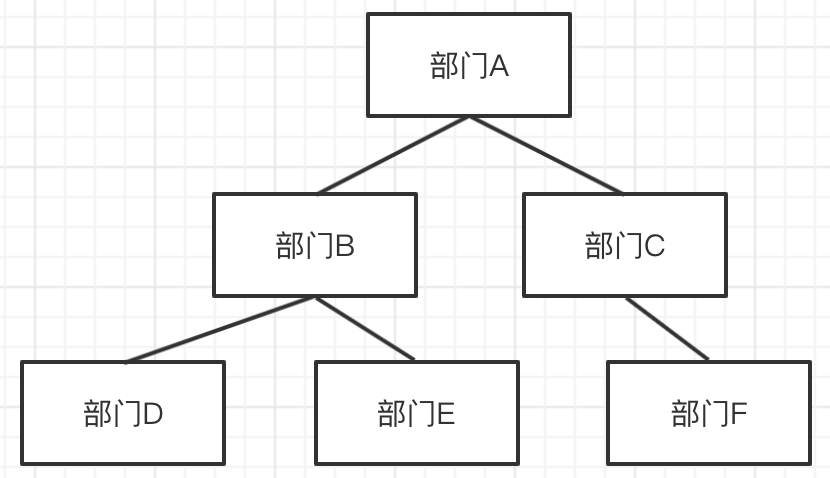

# 数组转树

## 题目

定义一个 `convert` 函数，将以下数组转换为树结构。

```js
const arr = [
  { id: 1, name: '部门A', parentId: 0 }, // 0 代表顶级节点，无父节点
  { id: 2, name: '部门B', parentId: 1 },
  { id: 3, name: '部门C', parentId: 1 },
  { id: 4, name: '部门D', parentId: 2 },
  { id: 5, name: '部门E', parentId: 2 },
  { id: 6, name: '部门F', parentId: 3 },
];
```



## 分析

定义树节点的数据结构

```ts
interface ITreeNode {
  id: number;
  name: string;
  children?: ITreeNode[];
}
```

遍历数组，针对每个元素

- 生成 tree node
- 找到 parentNode 并加入到它的 `children`

找 parentNode 时，需要根据 `id` 能**尽快**找到 tree node<br>
需要一个 map ，这样时间复杂度是 `O(1)` 。否则就需要遍历查找，时间复杂度高。

## 实现

代码参考 convert-arr-tree.ts

## 扩展

这两种数据结构很像 MySQL vs Mongodb ，一个关系型，一个文档型

```js
const arr = [
  { id: 1, name: '部门A', parentId: 0 }, // 0 代表顶级节点，无父节点
  { id: 2, name: '部门B', parentId: 1 },
  { id: 3, name: '部门C', parentId: 1 },
  { id: 4, name: '部门D', parentId: 2 },
  { id: 5, name: '部门E', parentId: 2 },
  { id: 6, name: '部门F', parentId: 3 },
];

class Node {
  constructor(id, name, children) {
    this.name = name;
    this.id = id;
    this.children = children;
  }
}

const getIdToNode = (arr) => {
  const map = new Map();
  arr.forEach((item) => {
    const { id, name } = item;
    map.set(id, new Node(id, name));
  });

  return map;
};

const convert = (arr) => {
  let root;
  const idToNode = getIdToNode(arr);

  arr.forEach(({ id, name, parentId }) => {
    if (parentId === 0) root = idToNode.get(id);
    if (idToNode.has(parentId)) {
      (
        idToNode.get(parentId).children ||
        (idToNode.get(parentId).children = [])
      ).push(idToNode.get(id));
    }
  });

  return root;
};

console.log(convert(arr));
```
